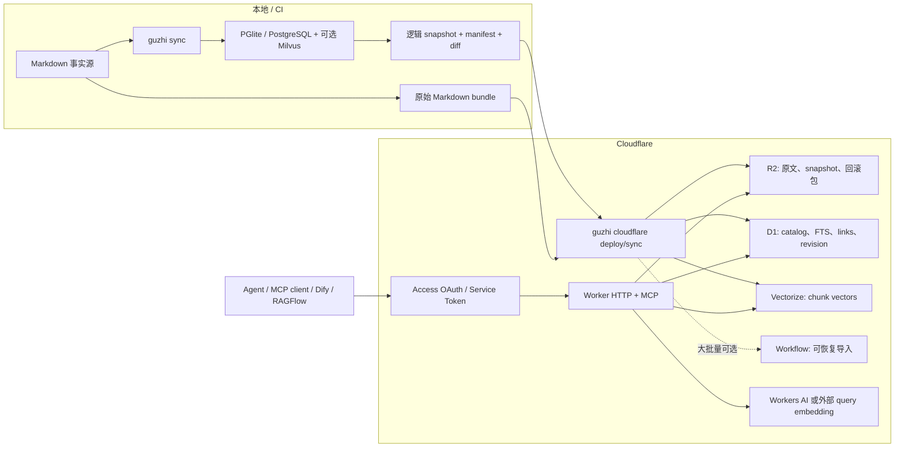

# Cloudflare 远端 RAG 发布：可行性分析与开发计划

> 状态：建议立项，但先做兼容性 spike
>
> 调研基线：2026-07-10；Cloudflare 的限制与价格在实施时需要再次核对

## 1. 结论

这个想法可行，而且与 Guzhi 当前边界基本一致。建议把它定义为：

> 将 Guzhi 已生成的派生 RAG 索引发布成 Cloudflare 上的版本化、只读知识库副本；Markdown 仍是唯一事实源，本地 Guzhi 仍负责解析、chunking、链接解析和增量构建。

不建议把 `.guzhi/db` 目录原样上传，也不建议把 Cloudflare 做成第四个 `storage.backend`。PGlite、PostgreSQL 和 Milvus 的物理形态不同，现有 Node 查询实现也不适合直接运行在 Workers。正确边界是新增一层跨后端的逻辑 snapshot/manifest，再由独立的 Cloudflare runtime 提供检索服务。

整体判断：

| 能力 | 可行性 | 结论 |
| --- | --- | --- |
| 已生成文档、chunk、metadata、links 搬运 | 高 | 当前 catalog 已拥有完整逻辑数据，只缺导出协议 |
| 已生成向量直接复用 | 有条件 | 必须不超过 Vectorize 1536 维，并保证云端查询使用同一 embedding 模型 |
| 增量同步与删除 | 高 | 现有内容 hash 可复用，但需要稳定远端 ID、manifest 和两阶段发布 |
| HTTP / Dify / RAGFlow | 高 | 可复用现有 `/search`、`/retrieval` 契约 |
| Remote MCP | 高 | Workers 已支持当前标准的 Streamable HTTP MCP |
| 私有访问 | 高 | 人员访问可用 Access OAuth；机器访问可用 Access service token |
| 与本地检索逐分一致 | 中 | 云端必须使用 D1 FTS + Vectorize 候选检索，不能继续全库内存扫描 |
| 中国大陆生产可达性和数据本地化 | 有明显前置条件 | 普通全球网络不等于中国大陆稳定低延迟；当前 Vectorize 也不是完整数据本地化方案 |

因此建议做，但第一阶段应先解决“可移植数据契约”，而不是先写 Worker。

## 2. 当前 Guzhi 能复用什么

当前实现已经具备多数源数据：

- Markdown 是事实源，数据库与向量库是可重建派生索引（`README.md:3-5, 338-345`）。
- 文档以 `content_hash + frontmatter_hash` 判断是否变化（`src/sync.ts:105-113`）。
- catalog 已包含 documents、chunks、links、embedding cache、queue 和 sync state（`src/storage.ts:149-228`）。
- 即使使用 Milvus，向量仍写入 catalog 的 `chunks.embedding` 和 `embedding_cache.vector`，所以不必从 Milvus 反向抽取（`src/storage.ts:465-500`）。
- 现有 HTTP 服务已经定义 chunk-level `/search` 和 Dify `/retrieval` 输出契约（`src/serve.ts`）。
- RRF / Weighted RRF、tier、evidence、facet 和诊断字段可以继续作为远端协议的一部分（`src/search.ts:201-315`）。
- 当前 skill 已经建立“检索结果是定位器，需要继续读取来源”的证据纪律（`src/skill.ts:20-25`）。

但不能直接搬运当前物理产物：

- PGlite 是一个 PostgreSQL 数据目录，不是可移植单文件。
- PostgreSQL 和 Milvus 可能是外部服务。
- `StorageAdapter` 当前实质上是具体 `SqlStorage`，还没有逻辑 export API（`src/storage.ts:85-107`）。
- 当前搜索会读取全部 active chunks，再在 JS 中计算 BM25 和本地 cosine（`src/storage.ts:579-603`、`src/search.ts:63-113`）；这个查询计划不适合 Workers。

当前 Guzhi 源码 checkout 没有可代表真实知识库的 `guzhi.toml` 或 `.guzhi/`；只有旧前缀的 smoke 数据。因此本文能确认代码级可行性，但不能替代对实际待发布知识库的维数、大小和数据分类检查。

## 3. 必须先解决的硬约束

### 3.1 向量不是无条件可搬

截至调研日，Vectorize 单向量最多 1536 维，vector ID 最长 64 bytes；一次 Worker upsert 最多 1000 条、HTTP API 最多 5000 条。详见 [Vectorize limits](https://developers.cloudflare.com/vectorize/platform/limits/)。

Guzhi 默认 embedding 维数是 1536，但 README 中 Qwen 示例是 4096。任何大于 1536 维的已有向量都不能直接进入 Vectorize。

发布命令必须显式支持两种策略，不能偷偷切换模型：

1. `reuse`：直接搬已有向量。
   - 维数必须在 Vectorize 限制内。
   - distance metric 必须兼容。
   - Worker 必须能够调用与文档向量相同的 query embedding 模型。
   - 本地 `127.0.0.1` embedding 地址显然不能被云端访问。

2. `reembed`：只搬 chunk 文本，在 Cloudflare 侧或部署期重新生成全部向量。
   - 可选择 Workers AI 支持的 embedding 模型，或一个云端可访问的 OpenAI-compatible provider。
   - 重嵌入后本地与云端属于两个不同 embedding profile，必须分别记录 fingerprint 和质量基线。

推荐 CLI 在 `doctor/deploy` 阶段 fail fast：

```text
vector_dimensions > 1536              -> 阻止 reuse
queued_embeddings > 0                 -> 默认阻止发布
failed_embeddings > 0                 -> 默认阻止发布
query_provider is loopback/private     -> 阻止 reuse
remote model fingerprint mismatched    -> 阻止激活 revision
```

### 3.2 本地 BM25 不能原样放到 Worker

当前 BM25 使用 Guzhi 自己的中文 `Intl.Segmenter` tokenization，并对 title 重复 4 次、slug 重复 3 次，然后对整个过滤后语料重新计算统计量。这种“每次全库载入并打分”会受到 Worker CPU、内存和 D1 返回量限制。

Cloudflare 版本应改成候选检索：

1. 部署期使用同一 tokenizer 预生成 FTS 文本。
2. D1 FTS5 召回 keyword top-N；D1 官方支持 FTS5，见 [D1 SQL statements](https://developers.cloudflare.com/d1/sql-api/sql-statements/)。
3. Vectorize 召回 vector top-N。
4. D1 按 chunk ID 回查 active revision 的正文与 metadata。
5. Worker 使用共享的 RRF、tier、evidence 纯函数融合候选。

这一方案能保留搜索思想和协议，但第一版不应承诺 BM25 分数与本地逐位一致。应通过真实查询集验收 Recall@K、nDCG 和关键问题的 top-N overlap。

### 3.3 Facet 不能全部下推 Vectorize

当前 Guzhi 支持任意 frontmatter facet，并在取回语料后过滤。Vectorize 每个索引最多 10 个 metadata indexes，且 string 索引值只索引前 64 bytes；metadata index 还必须在插入向量前创建。详见 [Vectorize metadata filtering](https://developers.cloudflare.com/vectorize/reference/metadata-filtering/)。

建议：

- D1 始终是完整 facet 的权威过滤层。
- Vectorize 只为 profile 中声明的高价值字段创建 metadata index，例如 `coding_system`、`safe_for_daily_qa`、`specialty`。
- 非下推 filter 使用 Vectorize over-fetch + D1 post-filter，并在诊断中报告 `filter_pushdown=false`。
- 对高度选择性的非下推 filter，要允许退回 keyword-only，避免静默产生低召回结果。

### 3.4 当前 ID 无法支撑稳定增量同步

当前 document ID 是随机 UUID；`chunk_uid` 又包含 `doc_id`。执行一次本地 `sync --full` 后，即使 Markdown 内容没变，远端也会看到所有 chunk ID 改变。

远端协议必须使用独立的稳定 ID：

```text
stable_doc_uid   = sha256(knowledge_base_id + ":" + normalized_path)
stable_chunk_uid = sha256(stable_doc_uid + ":" + anchor + ":" + seq + ":" + content_hash)
```

SHA-256 hex 正好是 64 个 ASCII bytes，适配当前 Vectorize ID 上限。

### 3.5 D1、R2、Vectorize 不是一个事务

Vectorize insert/upsert/delete 是异步可见的，通常需要数秒；详见 [Vectorize client API](https://developers.cloudflare.com/vectorize/reference/client-api/)。不能先删除线上数据，再逐项上传新数据。

发布协议应使用 staging revision：

1. 在 R2 上传不可变 snapshot 和原始 Markdown。
2. 在 D1 创建 `staging` deployment，写入 documents/chunks/links/FTS 数据。
3. 批量 upsert 新向量；写入请求和 batch checkpoint。
4. 通过 `getByIds`/抽样查询和计数做有界重试验证。
5. 在一个 D1 transaction 中切换 `active_revision`。
6. 查询只接受 active revision；Vectorize 返回的 staging/旧 ID 会被 D1 join 丢弃。
7. 激活成功后异步清理旧向量和过期 R2 revision。

这样即使同步中断，线上仍继续使用上一 revision。

Vectorize 只提供按 ID 删除（或删除整个 index），不提供按 document metadata 批量删除。因此 D1/manifest 必须保存 document 到全部 vector ID 的映射，不能把 Vectorize 当作删除 diff 的权威来源。

## 4. 推荐架构



### 服务职责

| Cloudflare 服务 | 是否为 v1 核心 | 职责 |
| --- | --- | --- |
| Workers | 是 | HTTP、MCP、query embedding、候选融合、权限后的 KB 路由 |
| D1 | 是 | 文档/chunk metadata、links、FTS、deployment revision、sync checkpoint |
| Vectorize | hybrid 模式必需 | Float32 chunk vectors；不要把大向量继续存在 D1 JSON |
| R2 | 推荐为核心 | 原始 Markdown、压缩 snapshot、回滚和审计包；支持 `get_document` |
| Access / Zero Trust | 私有模式必需 | 人员 OAuth/SSO、策略、服务凭据 |
| Workers AI | 可选 | reembed 或 query embedding；只有与索引模型一致时才可查询 |
| KV | OAuth 模式可选 | OAuth provider 的 token/session state，不存知识正文 |
| Workflows | 第二阶段可选 | 大型 snapshot 导入、重试、断点和清理 |
| Queues / Durable Objects | v1 不引入 | 当前没有必须依赖它们的实时写入或会话状态需求 |

远端 MCP 的检索工具是无状态的，优先使用 Cloudflare 当前推荐的 `createMcpHandler()`；没有必要仅为了 MCP 引入 per-session Durable Object。当前 Remote MCP 使用 Streamable HTTP，详见 [Build a Remote MCP server](https://developers.cloudflare.com/agents/model-context-protocol/guides/remote-mcp-server/)。

## 5. 远端数据契约

### Manifest

```json
{
  "format_version": 1,
  "knowledge_base_id": "medical-wiki",
  "revision": "20260710T120000Z-<manifest-hash>",
  "source_sync_run_id": "...",
  "created_at": "2026-07-10T12:00:00Z",
  "build_fingerprint": {
    "parser_version": 1,
    "chunking": {},
    "tokenizer_version": 1,
    "search_config": {}
  },
  "embedding_fingerprint": {
    "strategy": "reuse",
    "provider": "openai-compatible",
    "model": "...",
    "dimensions": 1536,
    "metric": "cosine"
  },
  "counts": {
    "documents": 0,
    "chunks": 0,
    "links": 0,
    "vectors": 0
  },
  "files": {},
  "manifest_sha256": "..."
}
```

`build_fingerprint` 至少包含 parser/export schema、chunking 配置、tokenizer 版本、tier boost 和搜索融合配置。当前本地 sync 只防 embedding fingerprint 漂移；开发 Cloud 发布前，也应补上本地 build fingerprint，否则 chunking 配置变化时未修改 Markdown 仍可能被跳过。

### Snapshot 文件

建议使用有序、可流式、可压缩的 NDJSON：

```text
manifest.json
documents.ndjson.gz
chunks.ndjson.gz
links.ndjson.gz
vectors.ndjson.gz
tombstones.ndjson.gz
```

R2 原文建议使用不可变 key：

```text
kb/<knowledge_base_id>/revisions/<revision>/documents/<encoded-path>.md
kb/<knowledge_base_id>/revisions/<revision>/snapshot/<file>
```

### D1 最小 read model

```text
knowledge_bases
deployments
documents
chunks
chunks_fts
links
sync_batches
```

FTS 使用部署期预分词内容，查询时仍使用共享 Guzhi tokenizer。完整 facet 保存在 D1 JSON；常用字段可另外生成 typed/indexed columns。

## 6. CLI 设计

使用完整的 `cloudflare` 命令组，避免把发布目标和本地 storage backend 混在一起：

```sh
# 前置检查：本地索引、向量维数、远端 provider、资源与权限
guzhi cloudflare doctor --profile prod

# 用户期望的“一键”入口：幂等 provision + Worker deploy + 首次数据发布
guzhi cloudflare deploy --profile prod --embedding-strategy reuse

# 后续增量同步；只搬已有派生数据，不隐式执行本地 guzhi sync
guzhi cloudflare sync --profile prod
guzhi cloudflare sync --profile prod --dry-run
guzhi cloudflare sync --profile prod --full

# 运维和接入材料
guzhi cloudflare status --profile prod
guzhi cloudflare mcp config --profile prod
guzhi skill install --transport cloudflare --profile prod --target /path/to/agent-repo
```

语义约束：

- `deploy` 是一键入口；资源已存在时只做幂等更新。
- `sync` 默认从现有 catalog 导出，不隐式重新解析 Markdown。后续可增加显式 `--sync-local`。
- `--dry-run` 不产生任何远端写入，输出 add/update/delete/skip、预计字节、向量维数和批次数。
- `--full` 上传新的完整 staging revision，绝不先清空线上 revision。
- 任一批失败后可以按 `deployment_id + revision + batch_id` 自动续传。
- 所有命令延续现有 `--json` 和统一错误格式；JSON/日志永不输出 token 或 secret。

建议非敏感配置：

```toml
[cloudflare.profiles.prod]
account_id = "..."
worker_name = "guzhi-medical-wiki"
knowledge_base_id = "medical-wiki"
d1_database = "guzhi-medical-wiki"
vectorize_index = "guzhi-medical-wiki"
r2_bucket = "guzhi-medical-wiki"
auth_mode = "access"
embedding_strategy = "reuse"
```

凭据只从 Wrangler 登录态、环境变量或 secret store 获取：

```text
CLOUDFLARE_API_TOKEN
CF_ACCESS_CLIENT_ID
CF_ACCESS_CLIENT_SECRET
```

不要增加 `--api-token`，避免 token 出现在 shell history 和进程列表。还应先修复 `config show` 的敏感字段脱敏；当前 Milvus token/password 也可能被完整显示（`src/config.ts:345-351`）。

## 7. MCP、skill 与 HTTP 接口

### Remote MCP

同一个 Worker 上提供 `/mcp`，第一版 tools：

- `search_knowledge(query, k, filters, explain)`
- `get_document(path_or_slug, revision?)`
- `get_chunk(chunk_uid)`
- `resolve_document(path_or_slug)`
- `list_links(path_or_slug)`
- `knowledge_status()`

`search_knowledge` 保留 `retrieval_mode`、`evidence`、`facets`、`content_hash`、`revision` 和诊断字段。`get_document` 从 R2 返回可核验原文，否则现有 skill 的“搜索结果不是最终证据”纪律在远端无法成立。

### Skill

现有 `skill install` 改为 transport-aware 模板：

- `local`：保持现在的 CLI 命令。
- `cloudflare-http`：调用远端 `/search`、`/document`。
- `mcp`：说明 MCP tool 使用顺序和证据边界。

生成的 `SKILL.md` 只引用环境变量名，不写 Access secret。

### 现有 HTTP 兼容

保留并共享同一搜索核心：

- `POST /search`
- `POST /retrieval`
- `GET /healthz`：只返回最小存活信息

不要照搬当前 Node `serve` 的安全默认值。当前 `/health` 在认证之前暴露 repo root、backend 与统计，CORS 也是 `*`；Cloudflare 私有模式应默认鉴权、CORS allowlist、无本地路径和内部资源名。

## 8. Zero Trust 与私有知识库模式

需要区分两类访问者：

### 人员 / 交互式 MCP 客户端

使用 MCP OAuth 2.1 + Cloudflare Access。Cloudflare 已提供 Access OAuth/Access for SaaS 的 Remote MCP 路径，可按用户、邮箱、IdP、设备信号等策略授权。参见：

- [Secure MCP servers with Cloudflare Access](https://developers.cloudflare.com/cloudflare-one/access-controls/ai-controls/secure-mcp-servers/)
- [Securing MCP servers](https://developers.cloudflare.com/agents/model-context-protocol/guides/securing-mcp-server/)

若启用 Access Managed OAuth，Worker 必须验证 Access JWT，不能只信任上游头部。

### 自动化 agent / CI / skill HTTP 调用

使用 Access service token，按调用方单独创建、定期轮换和可撤销。标准请求使用 `CF-Access-Client-Id` 与 `CF-Access-Client-Secret`；官方也支持为只能发送一个 header 的客户端配置单 header。参见 [Access service tokens](https://developers.cloudflare.com/cloudflare-one/access-controls/service-credentials/service-tokens/)。

需要把客户端兼容性视为产品能力，而不是部署细节：Access service token 的自定义 header 不是标准 MCP OAuth 流，一些客户端不能注入；部分客户端对远程 MCP/OAuth 的支持也不完整。第一版必须至少验证一个交互式 OAuth 客户端和一个 service-token 客户端，并为不支持自定义 header 的客户端保留 `mcp-remote` 或生成 helper/skill 的路径。

安全要求：

- ingestion 使用最小权限 Cloudflare API token，与查询凭据分离。
- 对每个 agent/client 单独发 service token，不共享一个永久 key。
- 不在 skill、TOML、manifest、日志或 MCP 输出中写 secret。
- 禁止未受 Access 保护的备用 hostname 绕过策略。
- 生产 profile 默认关闭 `workers.dev` 和 preview URL，或把它们纳入同一 Access 策略，避免 custom domain 之外出现公开旁路。
- query 日志默认不记录完整问题和返回正文；需要审计时记录主体、KB、tool、状态、耗时和结果数量。
- `/healthz` 不返回文档数、路径、模型 secret 或资源 ID。

## 9. 分阶段开发计划

### Phase 0：兼容性 spike（2-3 工程日）

目标：在大改之前确认真实知识库和 Cloudflare 限制能够相容。

- 对一个真实目标库输出 documents/chunks/vectors 数量、逻辑大小、embedding fingerprint、向量维数。
- 用 500-1000 个真实中文 chunk 验证 D1 FTS 分词、Vectorize 导入/查询和 Worker RRF。
- 验证 `reuse` 的 query embedding provider 能从 Worker 访问；若不能，验证一次 `reembed`。
- 用 MCP Inspector 和至少一个实际 agent client 验证 Streamable HTTP + Access OAuth。
- 用 service token 验证无浏览器机器调用。
- 记录中国大陆访问场景是否属于硬需求。

退出条件：选定 embedding 策略、检索方案、认证方案；没有未解释的维数或数据驻留阻塞。

### Phase 1：可移植 snapshot/manifest（4-6 工程日）

- 在 `StorageAdapter` 增加只读逻辑 export API。
- 新增稳定 document/chunk ID、排序、hash、manifest 和 diff。
- 导出 active documents/chunks/links/vectors 和 tombstones。
- 增加 build fingerprint；配置漂移时要求本地 `sync --full`。
- 增加 `guzhi export --format cloudflare` 内部能力，CLI 可以先不公开。

测试：

- PGlite/PostgreSQL/Milvus catalog 生成相同逻辑 snapshot。
- 本地 `sync --full` 后 stable ID 不变。
- 新增、修改、删除、排除、恢复、重命名 diff 正确。
- 有序导出重复运行得到相同 manifest hash。
- incomplete/failed embedding 默认不能发布。

### Phase 2：Cloudflare runtime 最小闭环（5-8 工程日）

- 建立独立 Worker runtime/tsconfig，禁止导入 PGlite、`pg`、Milvus SDK 或 `node:http`。
- 建立 D1 schema、FTS、R2 文档读取和 Vectorize 查询。
- 抽取 Node/Worker 共用 DTO、tokenizer、RRF、evidence、filter 纯函数。
- 实现 `/search`、`/retrieval`、`/document`、`/healthz`。
- 支持 `keyword`、`vector`、`hybrid` 与 explain diagnostics。

测试：

- 本地 Worker contract tests。
- 本地与远端协议 shape 一致。
- 中文 keyword 和 hybrid 真实查询集质量达标。
- restrictive facet 未下推时显式降级或报警。

### Phase 3：deploy/sync 命令与两阶段发布（5-8 工程日）

- 新增 `cloudflare doctor/deploy/sync/status` 命令组。
- 幂等创建/发现 Worker、D1、R2、Vectorize 资源。
- 实现 batch、retry、checkpoint、dry-run 和 remote manifest diff。
- 实现 staging revision、激活、回滚和延迟清理。
- 小规模由 CLI 直接批量调用；规模增长后再引入 R2 + Workflow 导入。
- 在 `.guzhi/cloudflare/<profile>/` 只缓存非敏感状态；远端 manifest 是 diff 权威。

测试：

- 无变化二次 sync 为 0 writes。
- 任一批次失败时 active revision 不变。
- 中断后重跑能续传，不重复创建资源。
- Vectorize 异步可见期间不会返回 staging/已删除正文。
- `--full` 不制造在线空窗。

### Phase 4：MCP、skill 与 Access（4-6 工程日）

- 使用 Streamable HTTP 实现 stateless MCP tools。
- 实现 Access OAuth/Access for SaaS 人员访问路径。
- 实现 service token 机器访问路径。
- 新增 `cloudflare mcp config` 与 transport-aware skill 模板。
- 加入 secret redaction、CORS allowlist、JWT/subject/KB authorization tests。

### Phase 5：真实云端回归、文档和发布（4-6 工程日）

- 增加 `GUZHI_CLOUDFLARE_TESTS=1` opt-in smoke suite，默认不创建或计费。
- 覆盖真实 D1/R2/Vectorize/Access 生命周期和资源清理。
- 建立检索质量基线、延迟和成本采样。
- README 只保留最短 quick start；详细运维、权限、回滚、排障放独立文档。
- 更新 npm package `files`，确保 Worker template/schema 随包发布。

单人实现预计：MVP 约 3-4 周；包含 Access、MCP、真实云回归和文档约 5-7 周。Phase 0 如果确认现有向量是 4096 维，则需要把全量 reembed 的成本和质量验证加入排期。

## 10. 验收标准

### 数据与同步

- 同一知识库在 PGlite、PostgreSQL、Milvus catalog 下均可发布。
- 无变化同步为 0 data writes。
- 修改单文档只更新对应文档、chunks、links 和 vectors。
- 删除/排除内容在激活后不可检索；旧 revision 可回滚。
- 任意阶段失败不会切换 active revision。
- manifest/count/checksum 可以从本地和远端相互核验。

### 检索

- `/search`、`/retrieval` 与本地已有响应契约兼容。
- `retrieval_mode`、embedding fingerprint、revision 和 filter pushdown 状态可观测。
- 在固定真实查询集上，云端 Recall@10 不低于本地基线的 95%；关键问题 top-5 回归逐项通过。
- `get_document` 返回与发布 revision hash 匹配的原始 Markdown。

### 安全

- 未认证请求不能读取搜索、文档、status 或 MCP tools。
- OAuth 用户和 service token 均有 KB 级授权测试。
- secret 不出现在 config show、日志、JSON 输出、skill、manifest 和错误栈中。
- 撤销 service token 后访问立即失败。
- 没有未保护的 workers.dev/custom-domain 旁路。

### 运维

- `doctor/deploy/sync/status` 支持稳定 `--json` 输出和明确修复提示。
- 中断同步可重试、可续传、可审计。
- 线上 revision 可一键回滚。
- 云端 smoke tests 为 opt-in，并能清理临时计费资源。

## 11. 不建议在第一版做的事情

- 不把 Cloudflare 作为新的本地 `storage.backend`。
- 不上传 PGlite 物理目录或直接共享 Milvus collection。
- 不在 Cloudflare 和本地同时拥有 Markdown 写权限。
- 不做双向同步、云端编辑或自动写回 Markdown。
- 不引入 Durable Objects/Queues，只因为它们属于 Cloudflare 产品组合。
- 不先做多租户共享索引；先按 profile/知识库隔离资源。
- 不用另一个 embedding 模型查询已有向量。
- 不把简单 Bearer key 当作最终私有 MCP 认证。
- 不承诺云端和本地 BM25 分数逐位一致。

## 12. 成本、地域与合规边界

没有真实 documents/chunks/vectors 数量与调用量之前，不应给出可靠月费。`cloudflare doctor --estimate-cost` 可在后续按以下维度估算：

- D1 数据大小、rows read/rows written。
- Vectorize 存储向量数 × dimensions，以及每次查询 topK × dimensions。
- R2 原文/snapshot 存储和 A/B 类操作。
- Worker 请求数与 CPU。
- Workers AI 输入量（若使用）。

平台硬限制也应在 doctor 中持续校验：D1 当前单库最大 10 GB（付费）/500 MB（免费），单行最大 2 MB；大删除和迁移需要分批。见 [D1 limits](https://developers.cloudflare.com/d1/platform/limits/)。原始 Markdown 当前允许最大 20 MB，因此完整原文不应塞进单个 D1 row，R2 更合适。

“Cloudflare 上随处访问”不等于“中国大陆稳定低延迟并满足境内数据要求”。Cloudflare 官方说明普通境外流量在中国大陆可能有明显延迟和可靠性问题；China Network 是 Enterprise 的独立订阅，且当前可用产品列表没有 D1/Vectorize，R2 bucket 也不能创建在中国大陆。参见 [China Network overview](https://developers.cloudflare.com/china-network/) 和 [available products](https://developers.cloudflare.com/china-network/reference/available-products/)。

对于病案、医保或任何可能含个人健康信息的数据，Zero Trust 只解决访问控制，不自动解决数据出境、数据驻留、合同与行业合规。当前 D1 jurisdiction 只有 EU 与 FedRAMP 等选项，Vectorize 也不兼容 Regional Services；应把数据分类、去标识化、部署地域和合同审查作为独立上线门禁。参见 [D1 data location](https://developers.cloudflare.com/d1/configuration/data-location/) 和 [Data Localization Suite compatibility](https://developers.cloudflare.com/data-localization/compatibility/)。

如果目标主要是个人/小团队的非敏感知识库，或访问者不要求中国大陆境内低延迟/境内存储，这套方案非常合适。如果目标是中国大陆医疗机构的生产知识库，这个 Cloudflare-native 组合只能作为 PoC 候选，不能在合规和网络评估前直接定为生产架构。

## 13. 建议的下一步

先只实施 Phase 0 和 Phase 1：

1. 选择一个真实知识库，运行只读统计，确认向量维数与远端 query embedding 可达性。
2. 固化 snapshot/manifest、稳定 ID 和 diff 测试。
3. 用 500-1000 个真实 chunk 做 D1 FTS + Vectorize + Access MCP spike。
4. spike 通过后，再进入完整 Worker 与一键部署开发。

这个顺序能最早暴露 4096 维、查询模型不可达、中国大陆访问或数据驻留等真正会否决方案的问题，同时不会破坏现有本地 RAG 主链。
